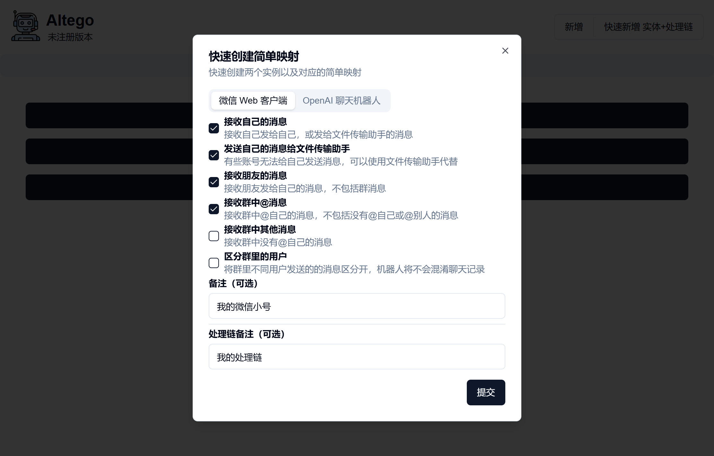

# ALTEGO

简单连接个人微信与 ChatGPT。

<details>
<summary><font color="red" size="12">免责声明【必读】</font></summary>

本工具仅供学习和技术研究使用，不得用于任何商业或非法行为，否则后果自负。

本工具的作者不对本工具的安全性、完整性、可靠性、有效性、正确性或适用性做任何明示或暗示的保证，也不对本工具的使用或滥用造成的任何直接或间接的损失、责任、索赔、要求或诉讼承担任何责任。

本工具的作者保留随时修改、更新、删除或终止本工具的权利，无需事先通知或承担任何义务。

本工具的使用者应遵守相关法律法规，尊重微信的版权和隐私，不得侵犯微信或其他第三方的合法权益，不得从事任何违法或不道德的行为。

本工具的使用者在下载、安装、运行或使用本工具时，即表示已阅读并同意本免责声明。如有异议，请立即停止使用本工具，并删除所有相关文件。

</details>

## **特点**

* 部署简单：只有一个可执行文件，支持 windows/linux 系统，支持 x64/arm 环境。
* 使用方便：简单配置后，即可正常使用。


## 使用方法

1. 启动应用，会启动本地 http 服务。默认地址为：[http://127.0.0.1:8080](http://127.0.0.1:8080) 。
2. 使用浏览器访问服务地址，点击`快速新增...`。
3. 配置微信 / OpenAI 接口。
4. 在界面上启动微信，用手机微信扫码登录，登录的账号即可按照设定工作。





## 其他配置项

可以使用以下环境变量调整程序行为，支持  `.env` 文件，以下为例子：

```properties
# 修改服务地址，默认为 127.0.0.1:8080
ALTEGO_BIND_ADDRESS=0.0.0.0:8081
# 数据文件路径，默认为当前路径
ALTEGO_DATA_DIR=.
# 微信下线邮件通知相关配置，默认不发送邮件
ALTEGO_SMTP_FROM="Your Name <your_mail@your_server.com>"
ALTEGO_SMTP_PASSWORD="YOUR PASSWORD HERE"
ALTEGO_SMTP_SERVER=your.smtp.server
ALTEGO_SMTP_TO="Your Receiver Name <your_receiver_mail@some_other_server.com>"
ALTEGO_SMTP_USERNAME=your_mail@your_server.com
```


## FAQ

1. 此工具的使用场景是什么？  
   答：对于技术人员而言，可以让自己和家人能方便快捷的使用 ChatGPT。也让自己能快速接入各种 chat API 来验证。
2. 同类工具已经有很多，为什么要重新写一个？  
   答：因为我需要在 arm 开发板上运行，既不能用 windows，又不想用太重的环境，如 python/nodejs 等。我需要一个轻量的服务。
3. 目前有哪些限制？  
   答：目前每种实例仅支持创建一个，避免用户由于微信多开或自动响应太多造成封号。另外，微信 web 客户端长时间运行可能会自动下线，只能设定邮件通知，无法自动重新登录。
4. 底层实现方式是什么？  
   答：使用 rust 参考其他语言的 SDK，重新实现了微信 web 协议。
5. 后续是否有计划扩展？  
   答：根据需求，可能会扩展微信对外接口，比如转发和外发消息；也可能增加对其他通信工具和 API 接口的支持，
6. 是否计划开源？  
   答：目前尚无计划。